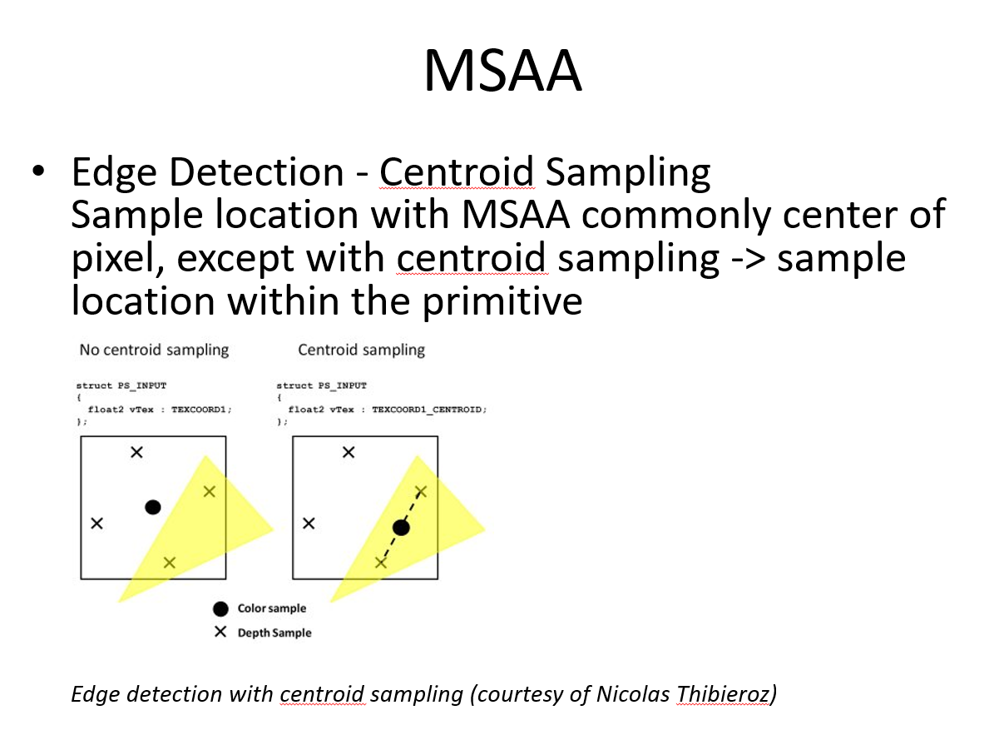
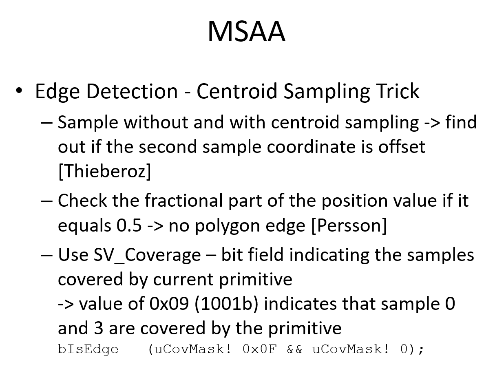
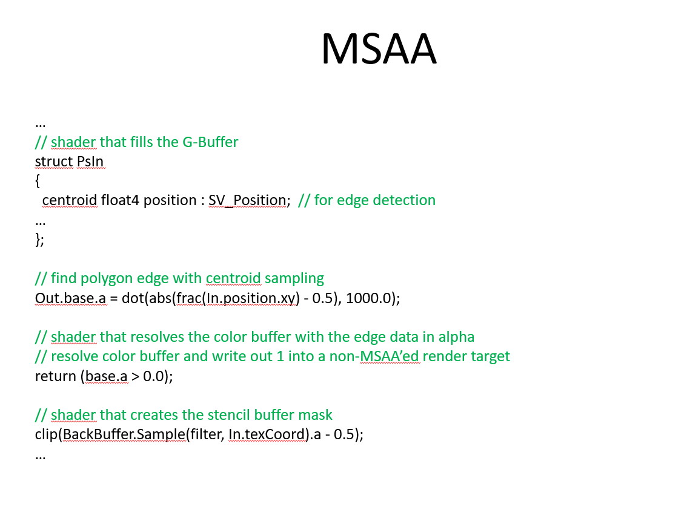
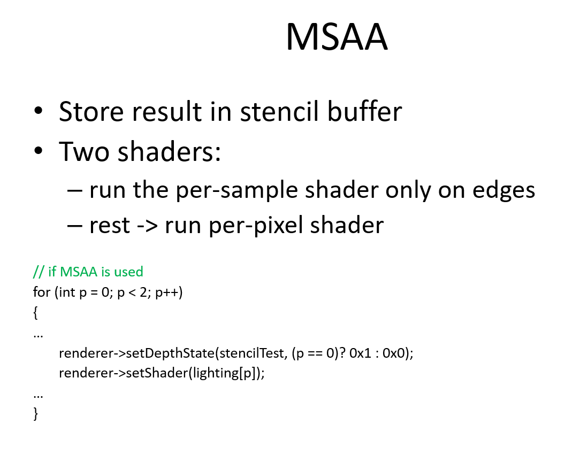
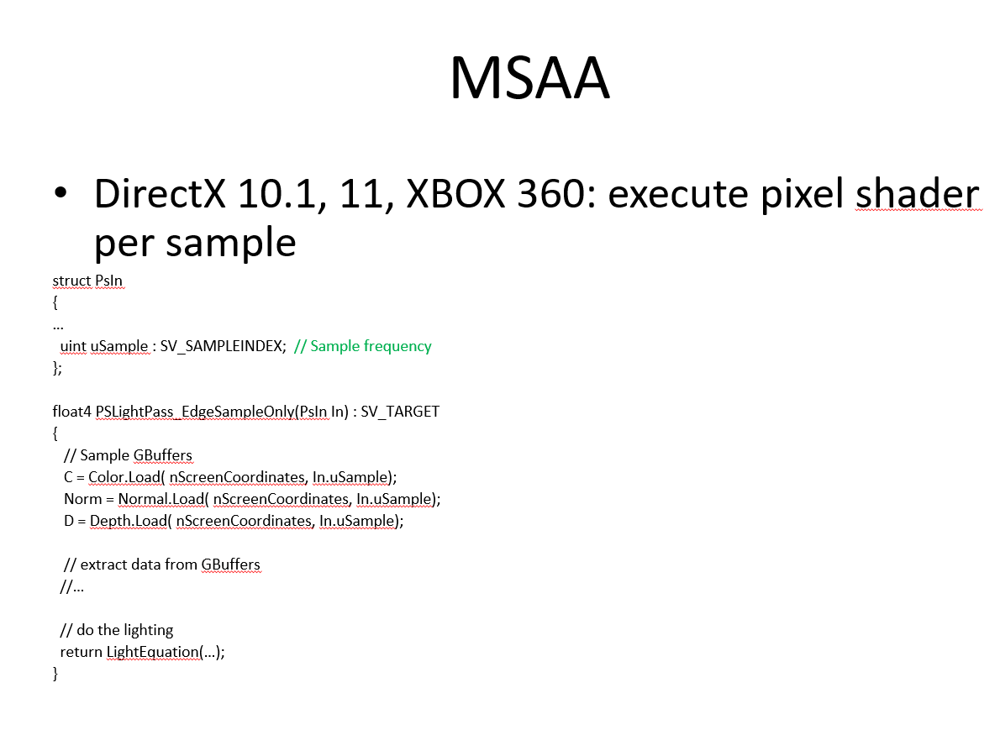

# MSAA 
This week we discussed MSAA in one of our chat groups at The Forge Interactive. This is an older topic now but I thought it might be interesting to refresh once's memory and put it into a more modern context. There are mostly two "groups" of MSAA techniques. Let me call the first one fixed-function MSAA and the second one programmable MSAA.

## Fixed-function MSAA
Fixed-function MSAA was the original MSAA implementation that is supported by various APIs and usually implemented on the driver / software level. The original idea was based on a render architecture that draws geometry into a color and a depth buffer and then the driver/hardware does a resolve and downscaling from the MSAA'ed image to the swap chain image. 
There are mostly two problems with that approach. It assumes that you directly render into color and depth buffer. For example a G-Buffer like setup wouldn't be supported because in most cases after the G-Buffer fill, geometric data is not rendered again.
It was common to conclude that this type of MSAA is not flexible enough to support complex game engine architectures. Even with a forward renderer that just renders into color and depth, you would have to do this before the PostFX pipeline starts running. So all the quarter-sized render targets in PostFX will happily add their staircase patterns on top of the MSAA'ed image.

## Programmable MSAA
The main advantage of programmable MSAA is that you can determine where in the rendering pipeline you want to anti-alias the image. Let's start by looking a bit deeper into how to program MSAA this way.

This image shows a best case scenario for MSAA. The quad is the pixel, each x marks a sample in that pixel. One thing to highlight is the 30 degree clockwise rotation of the samples. This is done because in games, lines that we want to anti-alias are quite often in a 45 degree angle, horizontal or vertical. So typically a 30 degree rotation works well (Read more about this here [MJP]).
Now apart from the 30 degree rotation why would one prefer multi-sampling over super-sampling. After all we can just increase the render target size in each diretion by 2x and then we would have the number of pixels as we have samples in MSAA. The main adantage of MSAA is the support of color compression when MSAA is on. Hardware utilizes efficient color compression that might be offering 2x MSAA for the same bandwidth cost as no MSAA and then even 4x MSAA might not be much more than No MSAA. In contrast a super sampled setup might be 4x memory bandwidth. It is a good assumption to make that memory bandwidth is not a big challenge with MSAA.
So the remaining question is: how often does the pixel shader have to run? With 4x Super sampling it needs to run 4x more. Does it also have to run 4x more with multi-sampling? The answer is: it depends on how you program it.

### Using a Per-Pixel or Per-Sample Pixel Shader
Let's assume we know where the polygon edges are, we could execute a pixel shader that is reading the MSAA sample points only on those edges. The graphics APIs allow us to decide if a pixel shader runs per-sample or per-pixel in that case. So the idea would be that we execute the per-pixel pixel shader first and then run the per-sample pixel shader only on the samples that are important to anti-alias polygon edges. 
This gives us a lot of flexibility. We can decide to run the whole PostFX pipeline with MSAA'ed render targets per pixel but then at the end run the per-sample shader over the polygon edges, or we can decide to run a per-sample shader on a render target in-between and at the end, just to avoid staircase effects there. In the Triangle Visibility Buffer we can shade the scene per-pixel but render per-sample. To go even one step further: MSAA is actually perfect for the Visibility Buffer: it causes the rasterizer and the depth test to run at a higher resolution than the render target(s), but a pixel shader can still execute once per pixel. So if we use all quarter-resolution render target combined with 4x MSAA, then we should get exactly what we want: full-resolution coverage and depth testing, but half-resolution shading. Following this train of thought one step further: if you want to compare programmable shading like this to Nanite: Programmable MSAA offers a higher rasterizer and depth test resolution, allowing to render smaller triangles. That means you have hardware support for small triangle rendering without having to write a software raterizer. Because you run in native MSAA resolution, you even don't have to upscale the final image. This way of small triangle rendering is consistent with the software and hardware pipeline.
Going back to our assumption at the beginning of this paragraph: now how do we know where the polygon edges are?

### Tracking and storing Polygon Edges
If we know the edges of the polygons, we know the areas where to apply multi-sampling with a per-sample pixel shader and we know where we can just run the per-pixel pixel shader.
One way to find out where in an image the polygon edges are is called Centroid Sampling that is widely supported in GPU hardware. 

#### Centroid Sampling
Here is an image from one of my old slide decks that I used for teaching MSAA. It explains how centroid sampling works:

In this image you can see a yellow triangle crossing a pixel and covering two sample points in that pixel. To reduce sampling artifacts for textures around poly edges the centroid sampling will shift the sampling point in-between the two sample points. 
When the shift happens, the coordinates of the sampling point changes.  

The following image lists one centroid sampling trick to detect polygon edges:

By using the SV_Coverage flag we can actually tell which samples of the pixel are covered by the triangle by checking a bit mask.

#### Storing Poloygon Edges in a Stencil Buffer
With the knowledge of where the polygon edges are in the image, we can store this data in a stencil buffer.

With the stencil buffer set, we can execute then two pixel shaders. One running per-pixel and one running per-sample:

Older platforms support running a per-sample pixel shader like this:

Look for the SV_SAMPLEINDEX flag. More modern APIs have more flexible ways to do this.

## Conclusion
The steps to utilize programmable Multi-sampling are:

1. In the geometry rendering pass, polygon edges can be detected that require multi-sampling and tracked by storing them in a stencil buffer
2. All pipeline stages can be run with MSAA'ed render targets
3. Multi-sampling can be applied to all of the MSAA'ed render targets or only a small selection
4. To apply Multi-sampling we let a per-sample pixel shader run on the polygon edges. In best case, it will only run on those edges based on the content of the stencil buffer

## Where to go from here
Programmable MSAA causes the rasterizer and the depth test to run at a higher resolution than the render target(s), but the pixel shader still executes once per-pixel or if you wish per-sample for polygon edges. Because of this it let's us tune the quality / performance ratio of our rendering pipeline depending on the performance of the underlying platforms. It can selectively provide quality to certain stages of the rendering pipline. It is a standard tool of the trade for graphics programmers. 
One topic that was not mentioned in this context but hinted towards is the ability to program sample points. I would like to refer to [MJP].
He describes interesting usage cases for "upsampling" with MSAA. Think of an efficient upscaling algorithm that does not require training AI data like -for example- DLSS and offers a finer granularity to pick a quality / performance ratio by letting the user run a pixel shader per sample or per pixel.

## References

[Engel] Wolfgang Engel, "Multisample Anti-Aliasing" https://diaryofagraphicsprogrammer.blogspot.com/2009/06/multisample-anti-aliasing.html

[MJP] Matt Petrino, "Stairway To (Programmable Sample Point) Heaven" https://therealmjp.github.io/posts/programmable-sample-points/

[Persson] Emil Persson, “Deferred Shading 2”, http://www.humus.name/index.php?page=3D

[Pranckevičius] Aras Pranckevičius, “Compact Normal Storage for small G-Buffers”, http://aras-p.info/texts/CompactNormalStorage.html

[Shishkovtsov] Oles Shishkovtsov, “Making some use out of hardware multisampling”; http://oles-rants.blogspot.com/2008/08/making-some-use-out-of-hardware.html 

[Thibieroz] Nick Thibieroz, “Deferred Shading with Multisampling Anti-Aliasing in DirectX 10” , ShaderX7 – Advanced Rendering Techniques, https://gitea.yiem.net/QianMo/Real-Time-Rendering-4th-Bibliography-Collection/raw/branch/main/Chapter%201-24/[1764]%20[ShaderX7%202009]%20Deferred%20Shading%20with%20Multisampling%20Anti-Aliasing%20in%20DirectX%2010.pdf

